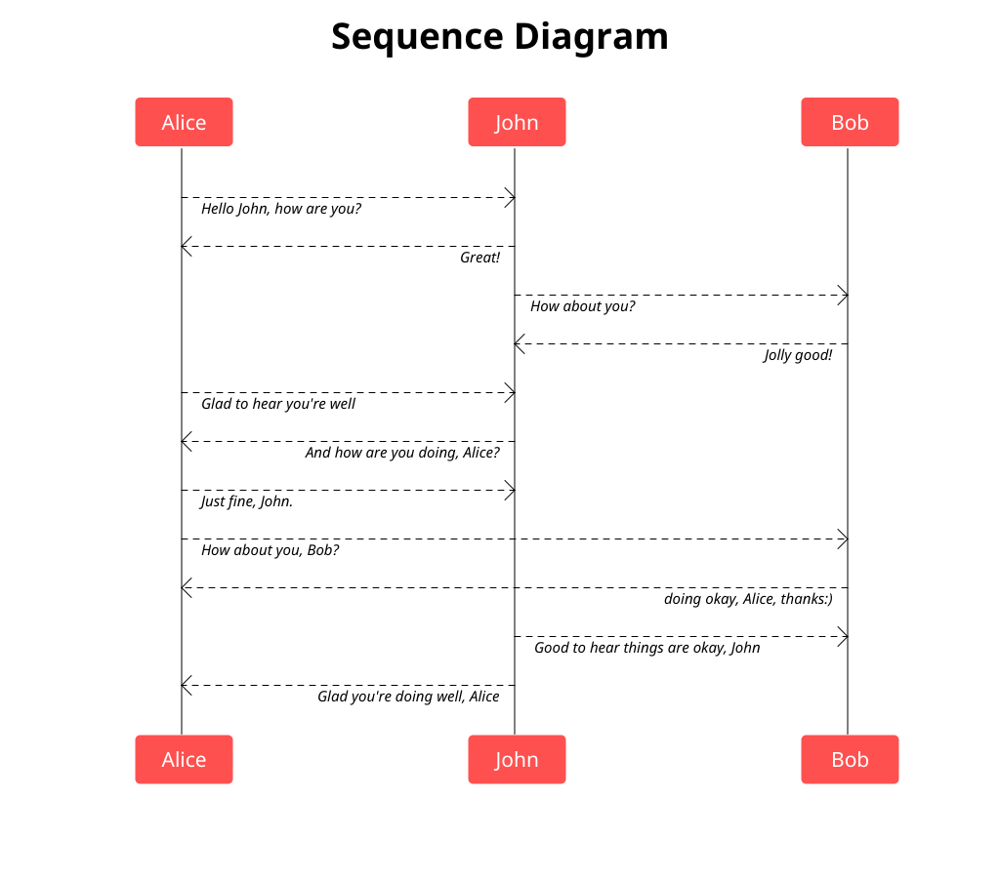

# ZML

[![CI][badge-build]][build]
[![GoDoc][go-docs-badge]][go-docs]
[![GoReportCard][go-report-card-badge]][go-report-card]
[![License][badge-license]][license]

Diagram and flowchart tool written in `Golang`

### Installation

```sh
$ go install github.com/jessp01/zml/cmd/zml_cli@latest
```

### Example

Running the below command with this input:
```
title: Sequence Diagram
Alice->>John: Hello John, how are you?
John-->>Alice: Great!
John->>Bob: How about you?
Bob-->>John: Jolly good!
Alice-->>John: Glad to hear you're well
John-->>Alice: And how are you doing, Alice?
Alice-->>John: Just fine, John. How about you, Bob?
Bob-->>Alice: doing okay, Alice, thanks:)
John-->>Bob: Good to hear things are okay, John
John-->>Alice: Glad you're doing well, Alice
```

```sh
$ ./zml_cli --font-dir /usr/share/texlive/texmf-dist/fonts/truetype/google/noto \
    --title-font "NotoSans-Bold.ttf,37" \
    --label-font "NotoSans-Italic.ttf,15" \
    --element-font "NotoSans-Regular.ttf,21" \
    ./examples/sequence_flow1.zml
```

Will produce [./examples/sequence_flow1.zml.png](./examples/sequence_flow1.zml.png)



See the [examples dir](./examples) for sample input files.

[license]: ./LICENSE
[badge-license]: https://img.shields.io/github/license/jessp01/zml.svg
[go-docs-badge]: https://godoc.org/github.com/jessp01/zml?status.svg
[go-docs]: https://godoc.org/github.com/jessp01/zml
[go-report-card-badge]: https://goreportcard.com/badge/github.com/jessp01/zml
[go-report-card]: https://goreportcard.com/report/github.com/jessp01/zml
[badge-build]: https://github.com/jessp01/zml/actions/workflows/go.yml/badge.svg
[build]: https://github.com/jessp01/zml/actions/workflows/go.yml

